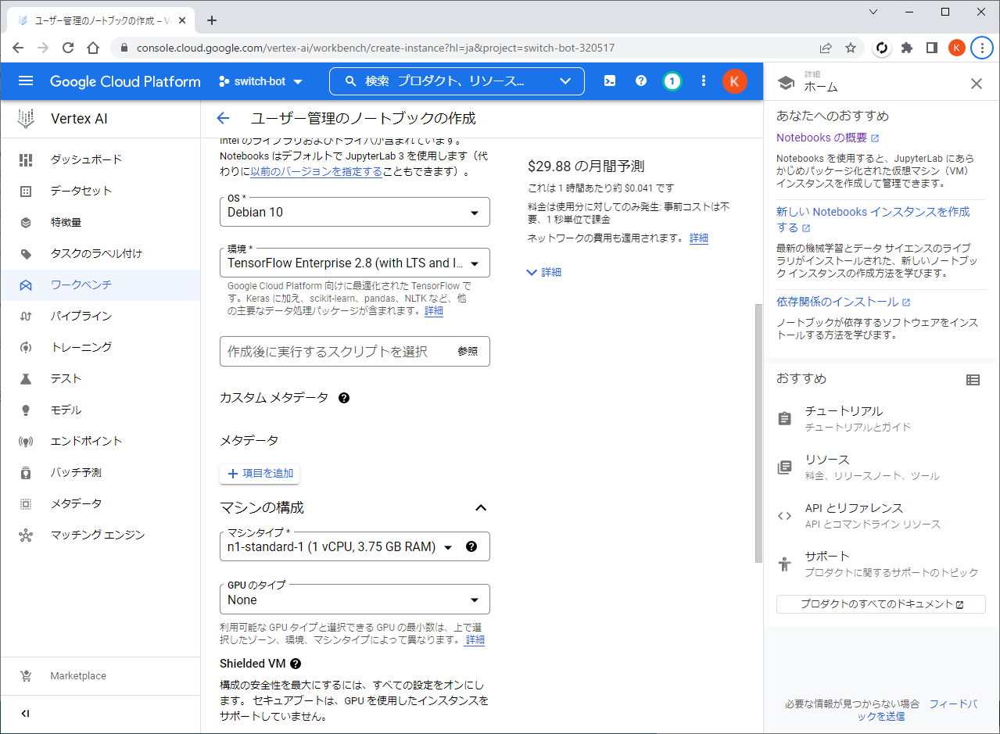
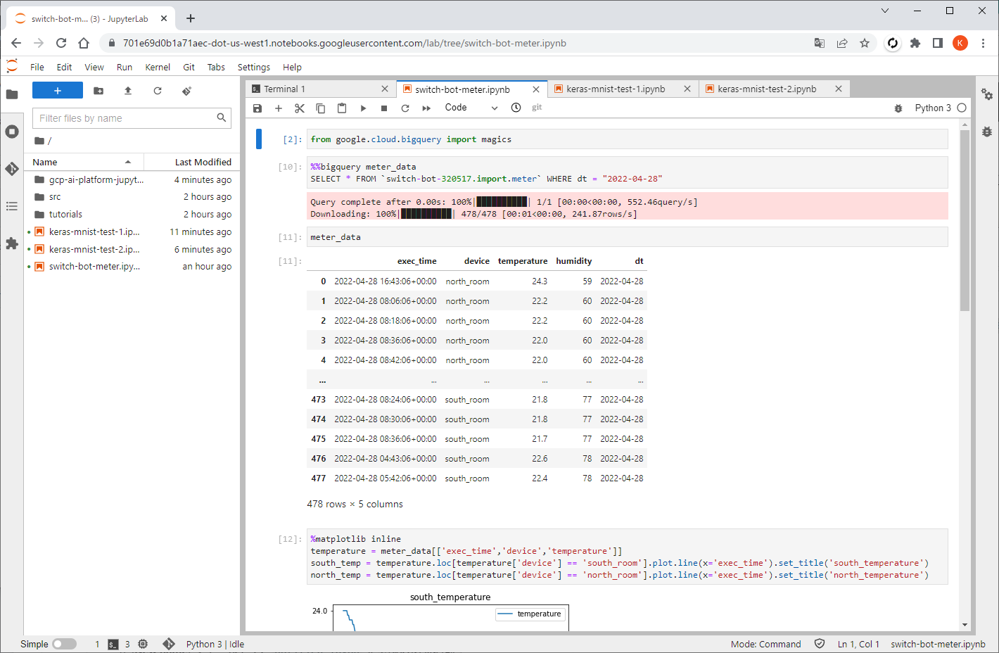

# gcp-ai-platform-jupyterlab

## 概要

GCP環境でJupyterLabを立ち上げて以下の動作を確認。  

* BigQueryに格納したデータを取得して可視化
* Kerasを使用した手書き文字認識(MNIST)

JupyterLabは、AI Platformのノートブックインスタンスにインストール済みのものを使用。

## JupyterLabの起動

Cloud Consoleで以下を選択。

- 人口知能
    - AI Platform
        - ワークベンチ
            - (有効化されていない場合) Notebooks API　→　有効にする

"新しいノートブック"を選択して、ノートブックインスタンスを作成。

作成後、"JUPYTERLABを開く"を選択してJupyterLabを起動。

## 参考

Notebooks の概要
https://cloud.google.com/vertex-ai/docs/workbench/user-managed/introduction?hl=ja